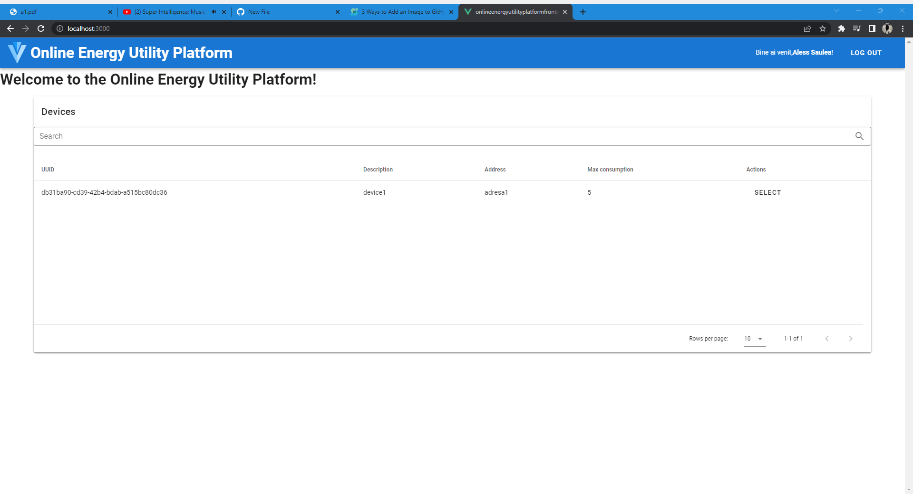
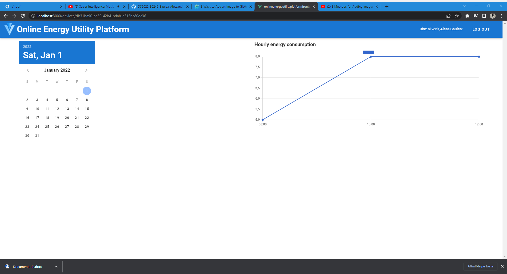

# DS2022_30242_Saulea_Alessandro_Assignment_1

  Aplicatia de backend se afla in folderul OnlineEnergyUtilityPlatform – backend. Este o aplicatie maven, fisierul pom.xml continand dependintele aplicatiei. Fisierul src/main/resources/application.properties contine toate configurarile aplicatiei. Am adaugat dependinta lombok pentru a reduce boilerplate-ul fiecarei clase. Aplicatia poate fi rulata cu comanda mvn package care creeaza un fisier .jar, iar apoi cu comanda java -jar ds-2020.0.0.1-SNAPSHOT.jar sau dintr-un IDE precum IntelliJ sau Eclipse.
  
  Aplicatia de frontend se afla in folderul onlineenergyutilityplatformfrontend. Pentru crearea proiectului, am instalat Node.js, apoi am instalat vue/cli cu comanda npm install -g @vue/cli. Dupa ce am creat proiectul cu comanda vue create nume_proiect, pe langa librariile VueJS care s-au instalat odata cu crearea proiectului, a mai fost nevoie de axios (npm install –save axios), util la apelarea endpoint-urilor din backend, vuetify (vue add vuetify), pentru folosirea componentelor de interfata Vue, libraria vue-chartkick pentru afisarea graficelor si de vuejs-datetimepicker pentru folosirea unui datetime picker necesar unui administrator pentru a selecta ziua si ora pentru care sa insereze o masurare a curentului. Aplicatia poate fi rulata cu comanda npm run serve. By default, aplicatia ruleaza pe portul 8080, dar acest port il folosesc deja pe aplicatia cu backend, astfel am schimbat portul aplicatiei Vue la 3000 (npm run serve –port 3000). De asemenea, poate fi rulata si intr-un IDE precum IntelliJ sau Visual Studio Code.

  Ambele aplicatii pot rula si folosind Docker. Pentru fiecare din aplicatii am adaugat cate un fisier Dockerfile, am rulat comanda docker build , creandu-se cate o imagine fara nume, si apoi am dat un nume la imagine cu docker tag. Apoi am rulat fisierul docker-compose.yml care creeaza cate un container pentru fiecare imagine creata la pasul anterior, cu comanda docker-compose up -d.
  
  Cum arata aplicatia:

